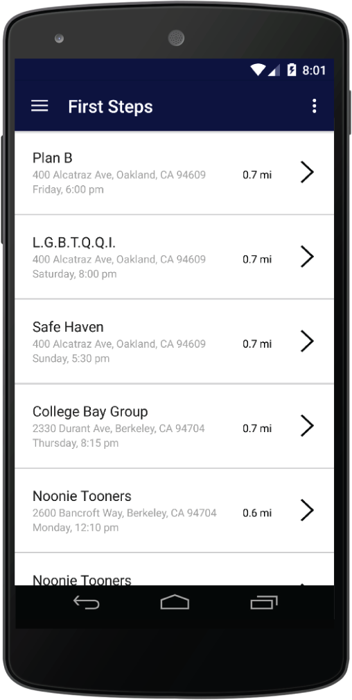
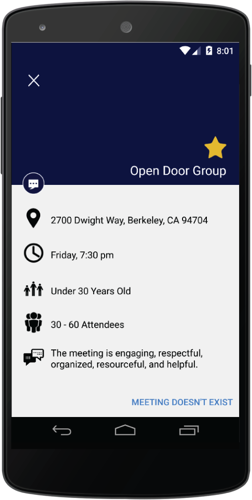

# First Steps
First Steps is an application that will help people start becoming sober. Too many people go to meetings, find that it’s not to their liking, think that all meetings are the same, and never go again. With our application, we help people find a meeting that fits them. It will help people feel more comfortable in meetings and want to continue attending. No other application or service does this. 
Beyond just newcomers, First Steps offers value to people who travel and don’t know what AA meetings are near them. We offer a wide range of ways to discover new meetings everywhere and of course, finding a meeting that fits them works for this demographic as well.

## Screenshots

##Members
Maya Angelica Hernandez  
Simon Cao  
Zach Hawtof  
Ryan Kapur  
Hector Gonzalez
